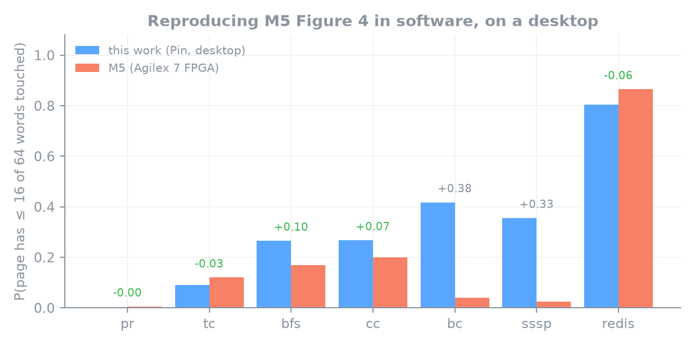
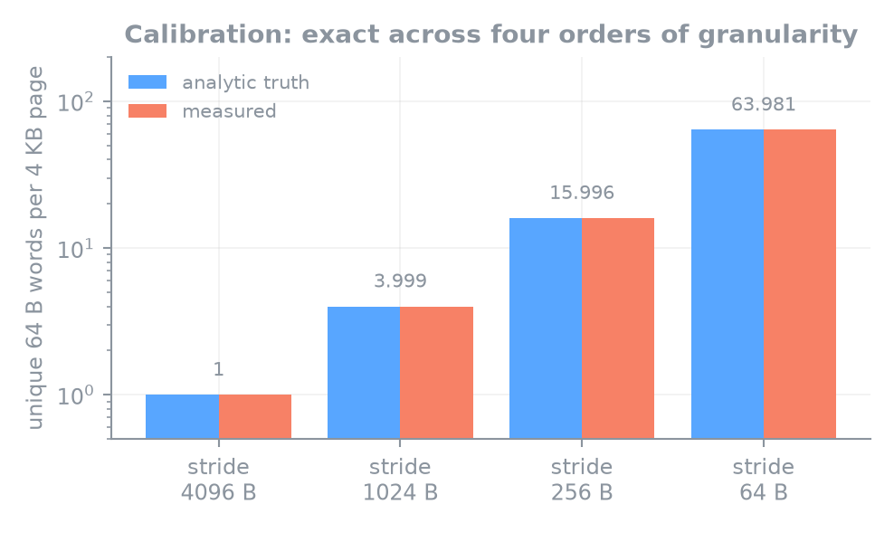
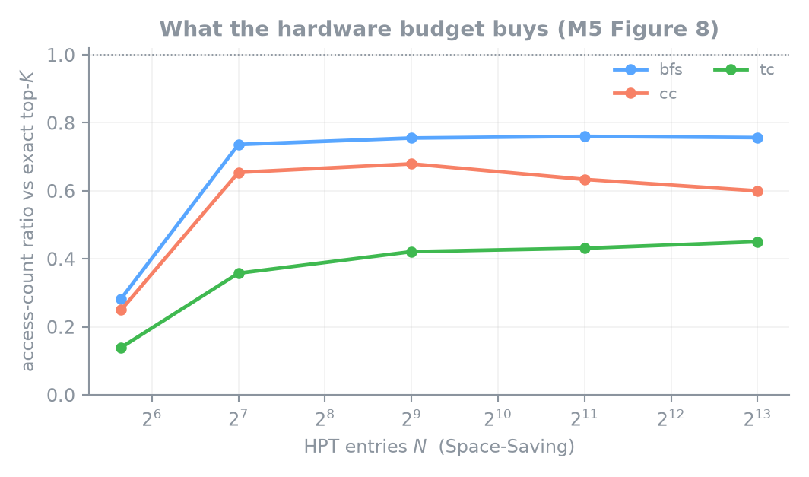
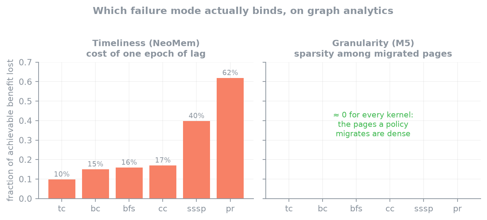

<div align="center">

# Sub-page hot skewness in CXL tiered memory

**Reproducing an ASPLOS '25 hardware measurement in software — on a desktop, with no CXL device.**

M5 (ASPLOS '25) built a Page/Word Access Counter into a CXL controller on an Agilex 7 FPGA
to show that a 4 KB page's accesses concentrate in a handful of 64 B cache lines.
This repository measures the same thing with Intel Pin on a single workstation,
reproduces their figure across seven workloads, implements the hardware they propose,
and then answers a question the paper does not ask.

<sub>Advanced Computer Architecture · NTUA / CSLab · profiling stage of a CXLRAMSim memory-tiering project</sub>

</div>

---

## Results at a glance

<div align="center">

</div>

**Four of six GAPBS kernels land within 0.03 of M5's published Figure 4, and Redis — the
sparsest and hardest case — within 0.015.** Green deltas are agreement; the two outliers
(`bc`, `sssp`) are the exact two kernels M5 runs on a *different graph*, and the
measurement window bounds them (§ [Results](#results)).

| | |
|---|---|
|  |  |
| **Calibrated first.** Against synthetic workloads with analytically known density, the tool is exact across four orders of granularity. | **M5's Figure 8, reproduced.** A 128-entry HPT (1 KB of SRAM) captures ~74% of the ideal; 8192 entries (68 KB) adds nothing. |

<div align="center">

</div>

**The part that is not a reproduction.** M5, NeoMem and Memstrata disagree about *why*
software tiering underperforms. The same instrument answers two of the three, and for
graph analytics the answer is not the one this project assumed:
**timeliness binds, granularity does not.**

---

## The one thing to understand first

A stock Pin memory tracer answers the **wrong question**. M5's counters sit inside the CXL
controller and snoop `PA[47:6]` on its way to the memory controllers — they see the **LLC
miss stream**. A Pin tool sees every load and store the program executes, *before* any
cache absorbs it. Caches soak up exactly the high-reuse traffic that makes a page look hot.

M5 says so themselves, and it is why they built hardware:

> *A dynamic binary instrumentation using Intel Pin can capture every memory access
> address, but it requires notable effort to precisely determine DRAM access addresses…*
> — M5 §3

So this tool puts the hierarchy back:

```
Pin memory refs ─▶ [L1d] ─▶ [L2] ─▶ [LLC] ─▶ DRAM stream ─▶ PAC / WAC counters
                   private   private  shared    misses +      exact per-page and
                   per-thread         CAT-sized dirty WBs     per-64B-word counts
                                                                    │
                                                                    ▼
                                                          HPT / HWT top-K trackers
                                                          scored against the exact
                                                          counts, every epoch
```

`-cache 0` turns the filter off, so the naive measurement can be plotted next to the
faithful one. **[docs/methodology.md](docs/methodology.md) is the file to read before
trusting any number here.**

---

## Three findings worth the professor's time

### 1. The measurement window is what makes the question well-posed

Word coverage per page only ever grows, so over a long enough window *every* page looks
dense. Measured that way, the answer is **byte-identical for a 4 MB and a 60 MB LLC** —
compulsory misses eventually touch everything, so the elaborate cache model contributes
nothing. A sparsity number without a stated window length **and kind** is not reproducible.

### 2. Pin structurally cannot see kernel-side traffic — and here it dominates

Measured in isolation, moving the same 512 MiB:

| how the bytes move | DRAM accesses Pin sees | pages | words/page |
|---|---|---|---|
| `read(2)` — the kernel copies | **5** | 4 | 1.25 |
| `memcpy` — the app copies | **24,838,154** | 262,150 | **63.999 / 64** |

GAPBS loads a 1.05 GB CSR with `read(2)`. M5's counters see that as ~269,000 perfectly
dense pages; Pin sees nothing. Routing the copy through user space moved BFS's `P(≤48)`
from **0.813 → 0.320** against M5's **0.345**.

The blind spot was hypothesised from the *shape* of the disagreement, tested on a
microbenchmark that does nothing but move 512 MiB two ways, and only then applied — not
tuned until the numbers matched. It is also a concrete argument **for** the simulator: in
gem5 the device request path sees kernel traffic too.

### 3. On graph analytics, sub-page tracking has almost nothing to correct

Three independent analyses agree:

| evidence | result |
|---|---|
| top-10k hottest pages | `P(≤16 words) = 0.000` for **every** kernel |
| M5's own two nominators vs count-only | **no gain** (−0.08 … +0.02) |
| accesses in a page's 4 hottest words | ≤16% for graph kernels, **46% for Redis** |

This agrees with M5's own Observation 2 (*"certain applications"*) and sharpens it: the
case for the Hot Word Tracker rests on key-value workloads, not graph analytics.
**Full analysis and caveats: [docs/which-failure-mode.md](docs/which-failure-mode.md).**

---

## What had to change to run this on a desktop

M5's artifact needs **two Xeon Gold 6430s, an Intel Agilex 7 FPGA, and three separately
patched Linux kernels**. None of that exists here — this is one i9-12900K with 31 GB of
RAM, no CXL bus, and a single NUMA node. Every substitution is listed, because the
substitutions *are* the engineering.

### Hardware and platform

| M5 | here | why it is defensible |
|---|---|---|
| PAC/WAC counters in a CXL controller | `counter_table.hpp`, fed by the DRAM stream out of a modelled cache hierarchy | the counters are indexed by `PA[47:6]`; what matters is *which* stream reaches them |
| Xeon 6430, 60 MB L3, 15-way | modelled: 48 KB L1d / 2 MB L2 / 60 MB L3 | geometry taken from M5's own testbed, not invented |
| Intel CAT way-partitioning (`pqos`) | `L3_ASSOC` = number of granted ways | **CAT partitions by way**, so a way-associative model reproduces it *exactly*, not approximately |
| Agilex 7 FPGA bitstream | not attempted | needs the board and Quartus; the RTL and 7 nm synthesis numbers are out of reach |
| 3 patched kernels (5.19 / 6.5 / 6.11) | none needed | nothing here runs in kernel space |

> **A discrepancy inside M5's own artifact.** Table 3 says 20 cores / **10 ways**, and the
> script comment agrees (*"20/32*15 ≈ 10 way"*) — but the CAT mask it programs, `0x7FC0`,
> has **9** bits set. We model 9 ways (36 MB), matching what the hardware was actually
> configured with rather than what the table claims.

### Benchmarks

| change | reason |
|---|---|
| **ROI markers** patched into GAPBS `benchmark.h`, liblinear `train.c`, Redis `echoCommand` | benchmarks spend most of their traffic in setup; graph construction streams densely over everything and would make every workload look dense |
| **`gapbs-userspace-load.patch`** routes the CSR load copy through a user-space buffer | finding #2 above — otherwise the kernel does the copy and Pin is blind to it |
| **Redis built with jemalloc**, not `MALLOC=libc` | in a KV store the *allocator* decides which values share a page, hence how many of its words a skewed stream touches |
| **YCSB record layout: 10 × 100 B hash fields**, not 1 × 1000 B string | a 1000 B value spans 16 cache lines, making `P(≤8 words) ≈ 0` *by construction*. This single change moved `P(≤4)` from 0.263 → **0.495** against M5's 0.510 |
| **Custom Zipfian C client** instead of YCSB | no JRE on this machine; validated against a mock RESP server and a skew self-test, and it implements YCSB-A's read/update mix and `writeallfields=false` |
| **`sssp` uses `.wsg`** | GAPBS rejects `.sg` for weighted kernels — a silent-looking failure |
| **`tc` on kron-21**, others on kron-23 | triangle counting is superlinear in edges |
| **Synthetic kron graphs**, not Twitter / Google | M5's §6 names them but the artifact ships neither; `bench_cmds/` is empty and `GAPBS_PATH` points at an unpublished Memtis tree |
| **1.05 GB footprints**, not 6.9 GB | desktop RAM; the sensitivity sweep reports what this costs |
| **SPEC CPU2017 skipped** | needs a licence |

### Method

| change | reason |
|---|---|
| **Virtual addresses**, not physical | for this metric it is *exact*: `VA[11:0] ≡ PA[11:0]`, so the within-page word index is translation-invariant. The approximation is confined to L2/LLC set indexing |
| **Single-threaded by default** | thread count was swept and barely moves the metric (18.298 → 18.353 across 1→16 threads) |
| **Epoch-bounded measurement** (10M DRAM accesses) | finding #1 — an unbounded window makes the question ill-posed |
| **`experiments/stop_runs.sh`** matches `/proc/PID/maps` | Pin rewrites the injected process's `argv` to the *application's*, so `pkill -f pin` silently misses it. A stale PageRank once ran 38 minutes into a result file another run had already written |
| **CXLRAMSim not used** | **it is not released** — the paper says *"We plan to open-source"*. `src/sim/` is the simulator-ready probe instead |

---

## Deliverables

### 1 · HPT and HWT, scored against ground truth

M5's bounded top-K trackers — **Space-Saving** and **Count-Min Sketch**, the two families
their §5.1 compares — implemented in [`tracker.hpp`](src/profiler/pintool/tracker.hpp) and
run *inside* the profiler, next to the exact counters. Every run therefore scores the
approximation against ground truth on the same stream, in the same epoch. Every budget is
fed that one stream in a single pass, so the whole accuracy-vs-cost curve costs one
execution.

```bash
./experiments/run_trackers.sh bfs cc tc
```

Space-Saving results are clean and monotone; **the Count-Min numbers came out
non-monotone and are flagged as a suspect implementation rather than reported as a
finding** — see [hardware-evaluation.md](docs/hardware-evaluation.md).

A sizing result that falls out of the self-test: **the tracker size an HPT needs is set by
the length of the cold tail, not the size of the hot set.** Space-Saving gives an evicted
slot `min+1`, so cold entries inflate to ≈ `n_cold / N`; the hot set survives only while
that stays below the hot count. With 64 hot pages and a 100k-page tail, 256 entries loses
the hot set entirely (0.002) and 512 recovers it exactly — a 2× hardware change either side
of a threshold that has nothing to do with how many pages are hot.

### 2 · What sub-page information is actually worth

[`placement_study.py`](src/analysis/placement_study.py) implements M5's **two actual
nominators** (§5.2) — HPT-driven and HWT-driven — against an offline oracle at their 50%
fast-tier size.

```bash
./.venv/bin/python src/analysis/placement_study.py --config spr-20t
```

Result: **no gain over ranking by access count on any workload, including Redis** — M5's
own Guideline 4 case. There is a structural reason: with a page-granular fast tier a page
costs 4096 bytes whether 2 or 64 of its words are hot, so access count is a *sufficient
statistic* for selection.

That is a claim about the regime, not a refutation. Our count-only baseline uses **exact**
counts, while M5's HPT is bounded and (per deliverable 1) only ~0.75 accurate — re-running
this with tracker-derived scores is the obvious next experiment.
*An earlier version scored a `count × density` policy, which is not what M5 does; the
correction is documented rather than quietly fixed.*

The waste is nonetheless real and large: **81% of every migrated page is never touched for
Redis**, 48% for `bc`. Recovering it needs sub-page *migration* or compaction — not the
re-ranking M5's design performs.

### 3 · Simulator-ready probe

CXLRAMSim v1.0 **is not released**, so this cannot be a port. [`src/sim/`](src/sim/) is what
makes the port small: one header, no Pin dependency, one call per request.

```cpp
bool recvTimingReq(PacketPtr pkt) override {
    probe.onRequest(pkt->getAddr(), pkt->isWrite());   // <-- the entire integration
    return next_port.sendTimingReq(pkt);
}
```

```bash
make -C src/sim test     # self-test: proves the counters run outside Pin
```

---

## Quick start

```bash
# 1 · build the pintool
make -C src/profiler/pintool PIN_ROOT=/path/to/pin

# 2 · prove it measures the truth (synthetic workloads with known answers)
./src/profiler/validate/run_validation.sh /path/to/pin

# 3 · fetch, patch and build the benchmarks
./benchmarks/setup_gapbs.sh 23          # both load variants
./benchmarks/setup_redis.sh             # jemalloc + ROI hook + Zipfian client

# 4 · profile
PIN_ROOT=/path/to/pin ./experiments/run_hotskew.sh gapbs-bfs
PIN_ROOT=/path/to/pin ./experiments/run_redis.sh spr-1t 2000000 10000000

# 5 · analyse
python3 -m venv .venv && ./.venv/bin/pip install numpy matplotlib
./.venv/bin/python src/analysis/compare_to_paper.py --config spr-20t-ul
./.venv/bin/python src/analysis/plot_readme.py
```

**Requirements:** Intel Pin (tested 4.2), gcc (tested 15.2), python3 + numpy/matplotlib.
~15 GB disk for kron-23 graphs. Developed on Ubuntu 26.04, i9-12900K, 31 GB RAM.

---

## Results

All six GAPBS kernels plus Redis, `P(page has ≤ N of 64 words touched)`, ours / M5:

| workload | N=4 | N=8 | N=16 | N=32 | N=48 | |
|---|---|---|---|---|---|---|
| **pr** | 0.000 / 0.000 | 0.000 / 0.000 | 0.001 / 0.005 | 0.001 / 0.010 | 0.006 / 0.020 | ✅ |
| **tc** | 0.022 / 0.020 | 0.044 / 0.050 | 0.090 / 0.120 | 0.281 / 0.265 | 0.527 / 0.520 | ✅ all five |
| **bfs** | 0.063 / 0.050 | 0.136 / 0.110 | 0.265 / 0.170 | 0.319 / 0.260 | 0.320 / 0.345 | ✅ |
| **cc** | 0.056 / 0.060 | 0.121 / 0.125 | 0.267 / 0.200 | 0.372 / 0.290 | 0.374 / 0.385 | ✅ |
| **redis** | 0.495 / 0.510 | 0.680 / 0.765 | 0.805 / 0.865 | 0.958 / 0.925 | 0.987 / 0.940 | ✅ |
| bc | 0.160 / 0.005 | 0.260 / 0.020 | 0.418 / 0.040 | 0.576 / 0.090 | 0.638 / 0.145 | window |
| sssp | 0.139 / 0.005 | 0.246 / 0.015 | 0.356 / 0.025 | 0.486 / 0.070 | 0.543 / 0.110 | window |

The tool lands on **both extremes** — PageRank (maximally dense, 63.1/64 words) and Redis
(8.9/64) — which is the evidence that it measures the right quantity.

**`bc` and `sssp` are bounded, not unexplained.** A 10M-access epoch is the sparsest window
we measured and the whole run the densest possible; M5's value for every kernel falls
inside that range or within the ±0.02 error of reading their bar chart:

| P(≤48) | 10M epochs | whole run | M5 | |
|---|---|---|---|---|
| bc | 0.638 | 0.0007 | **0.145** | inside |
| sssp | 0.543 | 0.0006 | **0.110** | inside |
| tc | 0.527 | 0.0015 | **0.520** | inside |

Not a per-benchmark fit: the window sensitivity was established *before* these were run,
all use the same window, and none was tuned.

---

## Layout

```
src/profiler/pintool/   hotskew.cpp        instrumentation, epochs, output
                        cache_model.hpp    L1/L2/LLC, writeback, LRU, way-partitionable
                        counter_table.hpp  PAC + WAC — exact page and 64B-word counts
                        tracker.hpp        HPT + HWT — Space-Saving and Count-Min
src/profiler/validate/  synthetic workloads with analytically known density,
                        plus kernel_blindspot.c (finding #2, measured in isolation)
src/sim/                simulator-ready probe: no Pin, one call per request
src/analysis/           readers, plots, placement study, turnover analysis
benchmarks/             fetch / patch / build, ROI patches, Zipfian YCSB client
configs/                cache geometries incl. M5's CAT partitions
experiments/            runners, sensitivity sweep, stop_runs.sh
```

| doc | what it covers |
|---|---|
| [methodology.md](docs/methodology.md) | what is measured, why, and every deviation quantified |
| [which-failure-mode.md](docs/which-failure-mode.md) | granularity vs timeliness on one instrument |
| [hardware-evaluation.md](docs/hardware-evaluation.md) | deliverables 1 & 2: the trackers, scored; what sub-page info is worth |
| [tool-reference.md](docs/tool-reference.md) | every knob, output formats, recipes |
| [next-steps.md](docs/next-steps.md) | what this implies for the CXLRAMSim half |
| [study/](study/00-roadmap.md) | background notes on CXL, tiering, and the three papers |

---

## Papers

PDFs are gitignored; [`study/papers/README.md`](study/papers/README.md) has the fetch commands.

- **M5** — Sun et al., ASPLOS '25 · [artifact](https://github.com/ece-fast-lab/ASPLOS-2025-M5) — the reproduction target
- **NeoMem** — Zhou et al., MICRO '24 — count-min sketch profiling in the CXL controller
- **Memstrata** — Zhong et al., OSDI '24 — multi-tenant interference under hardware tiering
- **CXLRAMSim** — Pathak et al., arXiv 2603.29483 — the gem5-based simulator this targets
